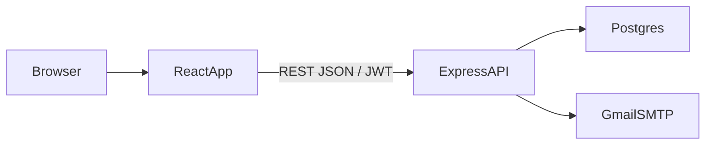
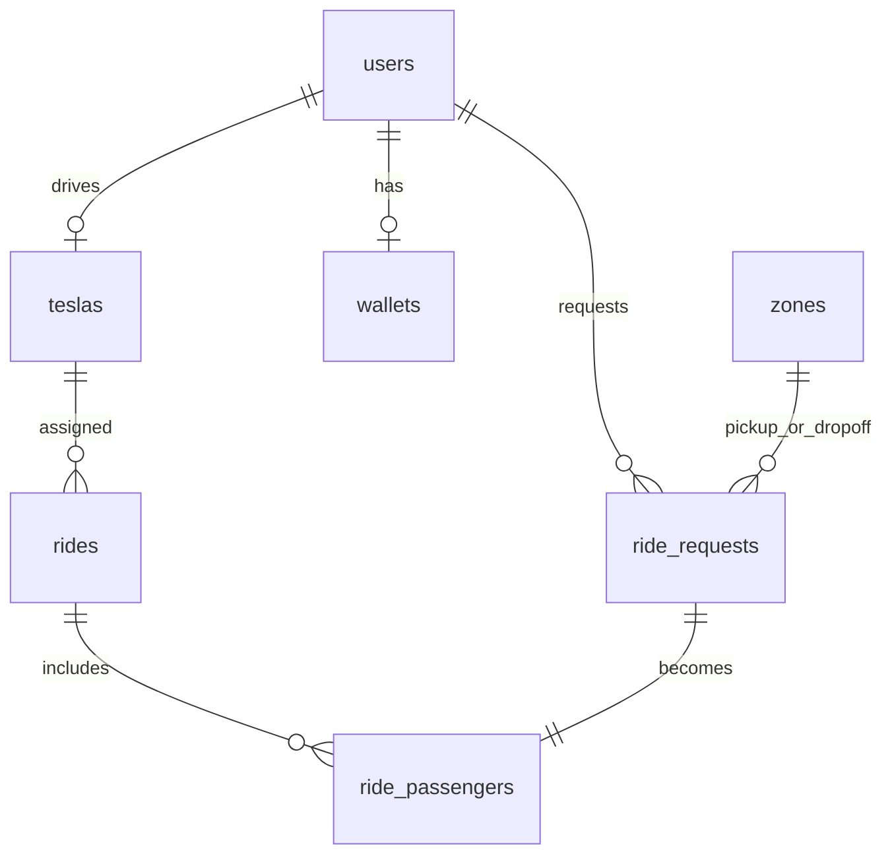

# Dhaka Tesla Pool

Share a seat. Split the fare. Survive Dhaka traffic.

This repository is the internship assessment MVP for a Dhaka ride-pooling app. **Auth, email verification, password reset, and the core Postgres schema are in place.** Ride matching / driver trip flows are the next increment.

## Problem

Passengers (Nusrat, Rafiq, Shirin) request rides. A driver (Jashim) owns a fixed-capacity Tesla (Bullet). Compatible requests can share one vehicle, each passenger seeing only their own fare and status.

## What works now

- Passenger and driver registration
- Email verification (6-digit code + link) before login
- Login with JWT
- Forgot / reset password via email
- Relational schema for users, teslas, zones, ride requests, rides, membership, fares (paisa), wallets, payments, audit events

## Architecture





## Stack (and why)

| Choice | Why it fits this MVP | Would switch if |
| --- | --- | --- |
| React + Vite | Mandated React; Vite is enough without SSR for a signed-in app | We needed SEO or App Router conventions |
| Express | Small REST surface, easy to explain, no Nest ceremony | Module count grows and DI/structure becomes painful |
| PostgreSQL | Pool capacity, FKs, CHECK constraints, transactions for the last-seat race | We needed a managed serverless DB with a different dialect |
| Raw SQL migrations | Schema is the product; evaluators can read every constraint | Team prefers Prisma migrations |
| JWT access tokens | Stateless API for a SPA | We add refresh rotation / many devices |
| Nodemailer + Gmail app password | Free, no paid ESP | Gmail sending limits or production branding |
| bcryptjs | Portable on Windows without a native compiler | Need the C bcrypt binding in production |
| Money as integer paisa | Fares must be hand-checkable with no float rounding | Multi-currency appears |

Alternatives considered: Next.js (fine, not required), NestJS (heavier than this API), Prisma (faster DX, hides SQL we want to defend), Redis (no need yet).

## Project structure

```
backend/          Express API, SQL migrations, seed
frontend/         React SPA (auth screens)
docker-compose.yml
.env.example
```

## Prerequisites

- Node.js 22+
- PostgreSQL 18 (local install is fine; Docker Desktop is optional)
- A Gmail account with an [App Password](https://myaccount.google.com/apppasswords)

Docker Desktop on this machine was not running when the project was set up (`dockerDesktopLinuxEngine` pipe missing). Local Postgres is the default path.

## Environment

Copy `.env.example` to `.env` and fill:

- `DATABASE_URL` — local user `safa` (see `.env.example`)
- `JWT_SECRET`
- `SMTP_USER` — **your Gmail address** (the app password alone is not enough)
- `SMTP_PASS` — 16-character Gmail app password
- `FRONTEND_URL` (`http://localhost:5173`)

Never commit `.env`.

## Local setup

1. Create the database:

```sql
CREATE DATABASE dhaka_tesla_pool;
```

2. Install and migrate:

```bash
cd backend
npm install
npm run migrate
npm run seed
npm run dev
```

3. Frontend:

```bash
cd frontend
npm install
npm install react-router-dom
npm run dev
```

4. Open `http://localhost:5173`, register with a **real inbox you control**, then verify from the email.

If `SMTP_USER` is missing, the API logs the verification code in the backend console (development only).

## Docker

When Docker Desktop is running:

```bash
docker compose up --build
```

## Assumptions

- One Tesla per driver, default capacity 3 (Bullet).
- Geography is a fixed list of Dhaka zones with lat/long — no Maps API.
- Fares will use `base + distance - poolDiscount` in paisa (implemented with the pooling feature, not in this auth slice).
- Unverified users cannot obtain a session.
- Password reset and verification emails do not reveal whether an address exists (generic responses), except validation errors on the form itself.

## Auth API

| Method | Path | Notes |
| --- | --- | --- |
| POST | `/api/auth/register` | Creates user + wallet; drivers also get a Tesla row |
| POST | `/api/auth/verify-email` | `{ email, code }` |
| GET | `/api/auth/verify-email?token=` | Link from email |
| POST | `/api/auth/resend-verification` | Rate-limited to 1/minute per user |
| POST | `/api/auth/login` | Rejects unverified emails and resends a code |
| POST | `/api/auth/forgot-password` | Always generic success |
| POST | `/api/auth/reset-password` | `{ token, password }` |
| GET | `/api/auth/me` | Bearer JWT |

## Known limitations (this increment)

- No ride request / matching UI yet
- Demo seed users (Jashim, Nusrat, Rafiq) not inserted until pooling work (they need real mailboxes or a documented demo password)
- Docker not verified on the original Windows host because the engine was down

## AI usage

- **Tool:** Cursor
- **Used for:** scaffolding Express/React, SQL schema, auth/email flows
- **Accepted:** storing money as integer paisa and hashing email tokens rather than storing raw codes
- **Changed:** did not wait on Docker Desktop; used the local PostgreSQL 18 install instead, while still shipping compose files
